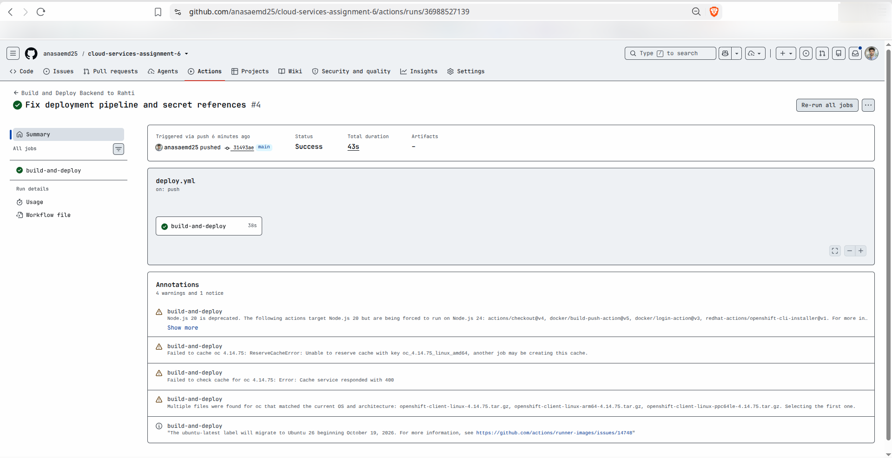
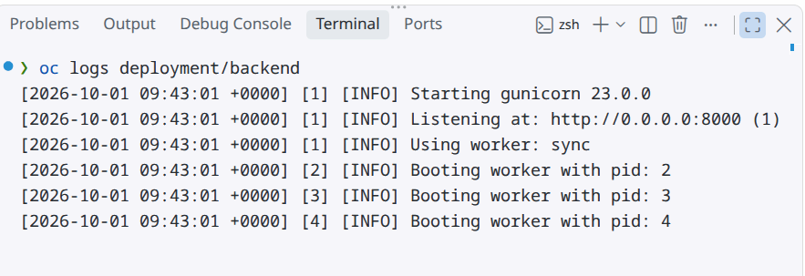
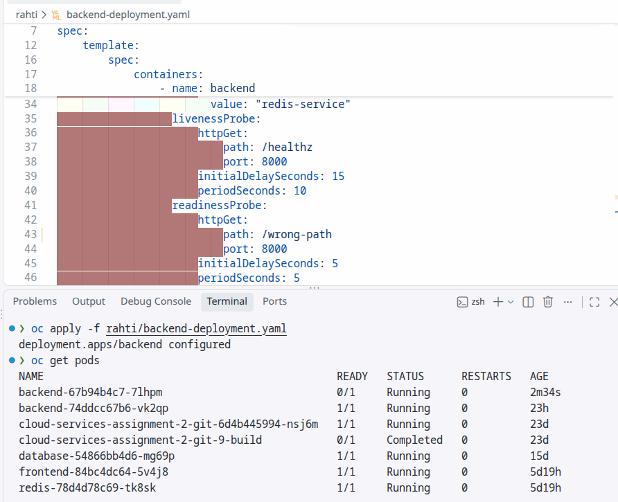
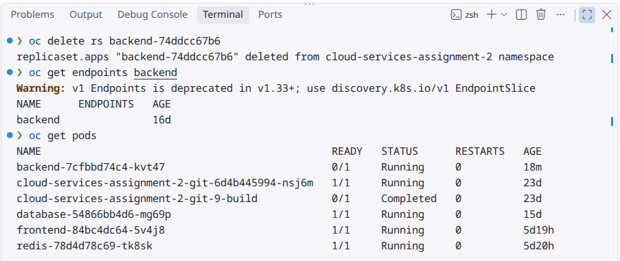

# Assignment 6: CI/CD Pipeline, Structured Logging & Health Probes

## Part A: Theory Questions & Answers

### 1. CI/CD Pipeline vs. Manual Deployment
* **Manual Deployment:** You build Docker images on your own computer and run `oc apply` manually from your terminal every time code changes. It is slow and easy to make mistakes.
* **CI/CD Pipeline:** An automated robot (like GitHub Actions) watches your code. Every time you push new code to GitHub, it automatically tests it, builds the Docker image, pushes it to Docker Hub, and updates Rahti without human intervention.

### 2. What is GitHub Actions?
GitHub Actions is a free automation service built directly into GitHub. It runs workflow scripts (defined in `.github/workflows/deploy.yml`) inside temporary cloud virtual machines whenever events happen (like pushing code to the `main` branch).

### 3. Observability & Structured Logging
* **Plain Logs:** Unstructured text like `user logged in` is hard for computers to search or analyze.
* **Structured Logs:** Logs formatted consistently (e.g., `Path: /api | Method: GET | Status: 200 | Time: 0.0120s`). This allows monitoring tools to parse request counts, response times, and error codes easily when debugging production issues.

### 4. Liveness Probe vs. Readiness Probe
* **Liveness Probe:** Asks *"Is the container still alive?"* If it fails (e.g., frozen app), OpenShift kills the container and restarts a new one.
* **Readiness Probe:** Asks *"Is the container ready to receive web traffic?"* If it fails (e.g., database warming up or route broken), OpenShift stops sending web requests to that pod until it becomes healthy again.

### 5. Managing Secrets Safely
Secret keys, passwords, and tokens must never be hardcoded into source code or saved in Git repositories. Doing so exposes them publicly. Instead, we store them as encrypted Environment Secrets in GitHub Actions and OpenShift `Secrets`, injecting them securely at runtime.

---

## Part B: Implementation & Verification Evidence

### 1. Automated CI/CD Pipeline
The pipeline builds the backend image, pushes it to Docker Hub, and updates the deployment in Rahti automatically.

### 2. Structured Application Logs
Viewing live backend logs using `oc logs deployment/backend` demonstrates formatted HTTP request tracking.

### 3. Readiness Probe Isolation (Pod Status)
Changing the readiness probe path to `/wrong-path` causes health checks to fail. OpenShift marks the pod as `0/1 READY`.

### 4. Readiness Probe Isolation (Endpoints)
Because the readiness probe failed, OpenShift completely removes the pod IP address from the active `endpoints` list to protect users from broken traffic.

